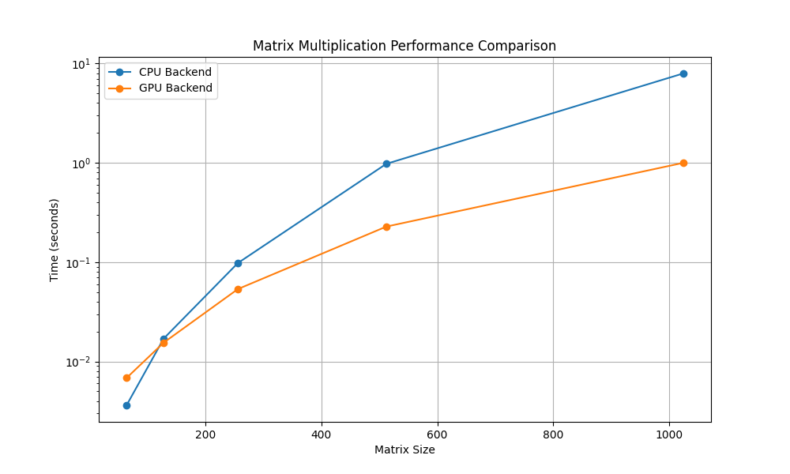

# MiniTorch Module 3


* Docs: https://minitorch.github.io/

* Overview: https://minitorch.github.io/module3.html


You will need to modify `tensor_functions.py` slightly in this assignment.

* Tests:

```
python run_tests.py
```

* Note:

Several of the tests for this assignment will only run if you are on a GPU machine and will not
run on github's test infrastructure. Please follow the instructions to setup up a colab machine
to run these tests.

This assignment requires the following files from the previous assignments. You can get these by running

```bash
python sync_previous_module.py previous-module-dir current-module-dir
```

The files that will be synced are:

        minitorch/tensor_data.py minitorch/tensor_functions.py minitorch/tensor_ops.py minitorch/operators.py minitorch/scalar.py minitorch/scalar_functions.py minitorch/module.py minitorch/autodiff.py minitorch/module.py project/run_manual.py project/run_scalar.py project/run_tensor.py minitorch/operators.py minitorch/module.py minitorch/autodiff.py minitorch/tensor.py minitorch/datasets.py minitorch/testing.py minitorch/optim.py

### Parallel Check
```
MAP

================================================================================
 Parallel Accelerator Optimizing:  Function tensor_map.<locals>._map,
/content/mod3-soundpulse/minitorch/fast_ops.py (164)
================================================================================


Parallel loop listing for  Function tensor_map.<locals>._map, /content/mod3-soundpulse/minitorch/fast_ops.py (164)
-----------------------------------------------------------------------------|loop #ID
    def _map(                                                                |
        out: Storage,                                                        |
        out_shape: Shape,                                                    |
        out_strides: Strides,                                                |
        in_storage: Storage,                                                 |
        in_shape: Shape,                                                     |
        in_strides: Strides,                                                 |
    ) -> None:                                                               |
        if np.array_equal(out_strides, in_strides) and np.array_equal(       |
            out_shape, in_shape                                              |
        ):                                                                   |
            for i in prange(len(out)):---------------------------------------| #0
                out[i] = fn(float(in_storage[i]))                            |
        else:                                                                |
            for i in prange(len(out)):---------------------------------------| #1
                out_index: Index = np.empty(MAX_DIMS, np.int32)              |
                in_index: Index = np.empty(MAX_DIMS, np.int32)               |
                                                                             |
                to_index(i, out_shape, out_index)                            |
                broadcast_index(out_index, out_shape, in_shape, in_index)    |
                o = index_to_position(out_index, out_strides)                |
                j = index_to_position(in_index, in_strides)                  |
                out[o] = fn(in_storage[j])                                   |
--------------------------------- Fusing loops ---------------------------------
Attempting fusion of parallel loops (combines loops with similar properties)...
Following the attempted fusion of parallel for-loops there are 2 parallel for-
loop(s) (originating from loops labelled: #0, #1).
--------------------------------------------------------------------------------
----------------------------- Before Optimisation ------------------------------
--------------------------------------------------------------------------------
------------------------------ After Optimisation ------------------------------
Parallel structure is already optimal.
--------------------------------------------------------------------------------
--------------------------------------------------------------------------------

---------------------------Loop invariant code motion---------------------------
Allocation hoisting:
The memory allocation derived from the instruction at
/content/mod3-soundpulse/minitorch/fast_ops.py (179) is hoisted out of the
parallel loop labelled #1 (it will be performed before the loop is executed and
reused inside the loop):
   Allocation:: out_index: Index = np.empty(MAX_DIMS, np.int32)
    - numpy.empty() is used for the allocation.
The memory allocation derived from the instruction at
/content/mod3-soundpulse/minitorch/fast_ops.py (180) is hoisted out of the
parallel loop labelled #1 (it will be performed before the loop is executed and
reused inside the loop):
   Allocation:: in_index: Index = np.empty(MAX_DIMS, np.int32)
    - numpy.empty() is used for the allocation.
None
ZIP

================================================================================
 Parallel Accelerator Optimizing:  Function tensor_zip.<locals>._zip,
/content/mod3-soundpulse/minitorch/fast_ops.py (214)
================================================================================


Parallel loop listing for  Function tensor_zip.<locals>._zip, /content/mod3-soundpulse/minitorch/fast_ops.py (214)
---------------------------------------------------------------------------|loop #ID
    def _zip(                                                              |
        out: Storage,                                                      |
        out_shape: Shape,                                                  |
        out_strides: Strides,                                              |
        a_storage: Storage,                                                |
        a_shape: Shape,                                                    |
        a_strides: Strides,                                                |
        b_storage: Storage,                                                |
        b_shape: Shape,                                                    |
        b_strides: Strides,                                                |
    ) -> None:                                                             |
        if (                                                               |
            np.array_equal(out_strides, a_strides)                         |
            and np.array_equal(out_strides, b_strides)                     |
            and np.array_equal(out_shape, a_shape)                         |
            and np.array_equal(out_shape, b_shape)                         |
        ):                                                                 |
            for i in prange(len(out)):-------------------------------------| #5
                out[i] = fn(float(a_storage[i]), float(b_storage[i]))      |
        else:                                                              |
            for i in prange(len(out)):-------------------------------------| #6
                out_index: Index = np.zeros(MAX_DIMS, np.int32)------------| #2
                a_index: Index = np.zeros(MAX_DIMS, np.int32)--------------| #3
                b_index: Index = np.zeros(MAX_DIMS, np.int32)--------------| #4
                to_index(i, out_shape, out_index)                          |
                o = index_to_position(out_index, out_strides)              |
                broadcast_index(out_index, out_shape, a_shape, a_index)    |
                j = index_to_position(a_index, a_strides)                  |
                broadcast_index(out_index, out_shape, b_shape, b_index)    |
                k = index_to_position(b_index, b_strides)                  |
                out[o] = fn(a_storage[j], b_storage[k])                    |
--------------------------------- Fusing loops ---------------------------------
Attempting fusion of parallel loops (combines loops with similar properties)...

Fused loop summary:
+--2 has the following loops fused into it:
   +--3 (fused)
   +--4 (fused)
Following the attempted fusion of parallel for-loops there are 3 parallel for-
loop(s) (originating from loops labelled: #5, #6, #2).
--------------------------------------------------------------------------------
---------------------------- Optimising loop nests -----------------------------
Attempting loop nest rewrites (optimising for the largest parallel loops)...

+--6 is a parallel loop
   +--2 --> rewritten as a serial loop
--------------------------------------------------------------------------------
----------------------------- Before Optimisation ------------------------------
Parallel region 0:
+--6 (parallel)
   +--2 (parallel)
   +--3 (parallel)
   +--4 (parallel)


--------------------------------------------------------------------------------
------------------------------ After Optimisation ------------------------------
Parallel region 0:
+--6 (parallel)
   +--2 (serial, fused with loop(s): 3, 4)


Parallel region 0 (loop #6) had 2 loop(s) fused and 1 loop(s) serialized as part
 of the larger parallel loop (#6).
--------------------------------------------------------------------------------
--------------------------------------------------------------------------------

---------------------------Loop invariant code motion---------------------------
Allocation hoisting:
The memory allocation derived from the instruction at
/content/mod3-soundpulse/minitorch/fast_ops.py (235) is hoisted out of the
parallel loop labelled #6 (it will be performed before the loop is executed and
reused inside the loop):
   Allocation:: out_index: Index = np.zeros(MAX_DIMS, np.int32)
    - numpy.empty() is used for the allocation.
The memory allocation derived from the instruction at
/content/mod3-soundpulse/minitorch/fast_ops.py (236) is hoisted out of the
parallel loop labelled #6 (it will be performed before the loop is executed and
reused inside the loop):
   Allocation:: a_index: Index = np.zeros(MAX_DIMS, np.int32)
    - numpy.empty() is used for the allocation.
The memory allocation derived from the instruction at
/content/mod3-soundpulse/minitorch/fast_ops.py (237) is hoisted out of the
parallel loop labelled #6 (it will be performed before the loop is executed and
reused inside the loop):
   Allocation:: b_index: Index = np.zeros(MAX_DIMS, np.int32)
    - numpy.empty() is used for the allocation.
None
REDUCE

================================================================================
 Parallel Accelerator Optimizing:  Function tensor_reduce.<locals>._reduce,
/content/mod3-soundpulse/minitorch/fast_ops.py (270)
================================================================================


Parallel loop listing for  Function tensor_reduce.<locals>._reduce, /content/mod3-soundpulse/minitorch/fast_ops.py (270)
-------------------------------------------------------------------|loop #ID
    def _reduce(                                                   |
        out: Storage,                                              |
        out_shape: Shape,                                          |
        out_strides: Strides,                                      |
        a_storage: Storage,                                        |
        a_shape: Shape,                                            |
        a_strides: Strides,                                        |
        reduce_dim: int,                                           |
    ) -> None:                                                     |
        out_index: Index = np.zeros(MAX_DIMS, np.int32)------------| #7
                                                                   |
        reduce_size = a_shape[reduce_dim]                          |
        # first buffer the positions                               |
        for i in prange(len(out)):---------------------------------| #9
            out_index: Index = np.zeros(MAX_DIMS, np.int32)--------| #8
                                                                   |
            to_index(i, out_shape, out_index)                      |
            o = index_to_position(out_index, out_strides)          |
                                                                   |
            for j in range(reduce_size):                           |
                out_index[reduce_dim] = j                          |
                a_pos = index_to_position(out_index, a_strides)    |
                out[o] = fn(out[o], a_storage[a_pos])              |
--------------------------------- Fusing loops ---------------------------------
Attempting fusion of parallel loops (combines loops with similar properties)...
Following the attempted fusion of parallel for-loops there are 2 parallel for-
loop(s) (originating from loops labelled: #9, #8).
--------------------------------------------------------------------------------
---------------------------- Optimising loop nests -----------------------------
Attempting loop nest rewrites (optimising for the largest parallel loops)...

+--9 is a parallel loop
   +--8 --> rewritten as a serial loop
--------------------------------------------------------------------------------
----------------------------- Before Optimisation ------------------------------
Parallel region 0:
+--9 (parallel)
   +--8 (parallel)


--------------------------------------------------------------------------------
------------------------------ After Optimisation ------------------------------
Parallel region 0:
+--9 (parallel)
   +--8 (serial)


Parallel region 0 (loop #9) had 0 loop(s) fused and 1 loop(s) serialized as part
 of the larger parallel loop (#9).
--------------------------------------------------------------------------------
--------------------------------------------------------------------------------

---------------------------Loop invariant code motion---------------------------
Allocation hoisting:
The memory allocation derived from the instruction at
/content/mod3-soundpulse/minitorch/fast_ops.py (284) is hoisted out of the
parallel loop labelled #9 (it will be performed before the loop is executed and
reused inside the loop):
   Allocation:: out_index: Index = np.zeros(MAX_DIMS, np.int32)
    - numpy.empty() is used for the allocation.
None
MATRIX MULTIPLY

================================================================================
 Parallel Accelerator Optimizing:  Function _tensor_matrix_multiply,
/content/mod3-soundpulse/minitorch/fast_ops.py (297)
================================================================================


Parallel loop listing for  Function _tensor_matrix_multiply, /content/mod3-soundpulse/minitorch/fast_ops.py (297)
----------------------------------------------------------------------------------------|loop #ID
def _tensor_matrix_multiply(                                                            |
    out: Storage,                                                                       |
    out_shape: Shape,                                                                   |
    out_strides: Strides,                                                               |
    a_storage: Storage,                                                                 |
    a_shape: Shape,                                                                     |
    a_strides: Strides,                                                                 |
    b_storage: Storage,                                                                 |
    b_shape: Shape,                                                                     |
    b_strides: Strides,                                                                 |
) -> None:                                                                              |
    """NUMBA tensor matrix multiply function.                                           |
                                                                                        |
    Should work for any tensor shapes that broadcast as long as                         |
                                                                                        |
    ```                                                                                 |
    assert a_shape[-1] == b_shape[-2]                                                   |
    ```                                                                                 |
                                                                                        |
    Optimizations:                                                                      |
                                                                                        |
    * Outer loop in parallel                                                            |
    * No index buffers or function calls                                                |
    * Inner loop should have no global writes, 1 multiply.                              |
                                                                                        |
                                                                                        |
    Args:                                                                               |
    ----                                                                                |
        out (Storage): storage for `out` tensor                                         |
        out_shape (Shape): shape for `out` tensor                                       |
        out_strides (Strides): strides for `out` tensor                                 |
        a_storage (Storage): storage for `a` tensor                                     |
        a_shape (Shape): shape for `a` tensor                                           |
        a_strides (Strides): strides for `a` tensor                                     |
        b_storage (Storage): storage for `b` tensor                                     |
        b_shape (Shape): shape for `b` tensor                                           |
        b_strides (Strides): strides for `b` tensor                                     |
                                                                                        |
    Returns:                                                                            |
    -------                                                                             |
        None : Fills in `out`                                                           |
                                                                                        |
    """                                                                                 |
    assert a_shape[-1] == b_shape[-2]                                                   |
                                                                                        |
    a_batch_stride = a_strides[0] if a_shape[0] > 1 else 0                              |
    b_batch_stride = b_strides[0] if b_shape[0] > 1 else 0                              |
                                                                                        |
    # Main parallel loop                                                                |
    for p in prange(len(out)):----------------------------------------------------------| #10
        # Calculate positions                                                           |
        m = (p % (out_shape[-1] * out_shape[-2])) // out_shape[-1]                      |
        n = p % out_shape[-1]                                                           |
                                                                                        |
        # Positions per movement: R * C                                                 |
        batch = p // (out_shape[-1] * out_shape[-2])                                    |
                                                                                        |
        # Get starting positions                                                        |
        a_pos = batch * a_batch_stride + m * a_strides[-2]                              |
        b_pos = batch * b_batch_stride + n * b_strides[-1]                              |
                                                                                        |
        # A: [B, M, K]                                                                  |
        # B: [B, K, N]                                                                  |
        # out: [B, M, N]                                                                |
        temp = 0.0                                                                      |
        for k in range(a_shape[-1]):                                                    |
            temp += (                                                                   |
                a_storage[a_pos + k * a_strides[-1]]                                    |
                * b_storage[b_pos + k * b_strides[-2]]                                  |
            )                                                                           |
                                                                                        |
        out[batch * out_strides[0] + m * out_strides[1] + n * out_strides[2]] = temp    |
--------------------------------- Fusing loops ---------------------------------
Attempting fusion of parallel loops (combines loops with similar properties)...
Following the attempted fusion of parallel for-loops there are 1 parallel for-
loop(s) (originating from loops labelled: #10).
--------------------------------------------------------------------------------
----------------------------- Before Optimisation ------------------------------
--------------------------------------------------------------------------------
------------------------------ After Optimisation ------------------------------
Parallel structure is already optimal.
--------------------------------------------------------------------------------
--------------------------------------------------------------------------------

---------------------------Loop invariant code motion---------------------------
Allocation hoisting:
No allocation hoisting found
None
```

# Task 3.4


# Task 3.5
## Note: Increased Batch to 64 to improve GPU Utilization, which greatly improved the time/epoch on CudaOps.

### CPU (Simple)
```
Epoch  0  loss  56.000299620024734 correct 27 duration per epoch: 1.659 seconds
Epoch  10  loss  20.301594995025233 correct 47 duration per epoch: 0.066 seconds
Epoch  20  loss  14.337109936308988 correct 49 duration per epoch: 0.052 seconds
Epoch  30  loss  11.660893959130911 correct 49 duration per epoch: 0.04 seconds
Epoch  40  loss  9.934691741736147 correct 49 duration per epoch: 0.039 seconds
Epoch  50  loss  8.700341836406107 correct 49 duration per epoch: 0.041 seconds
Epoch  60  loss  7.7346915797869356 correct 50 duration per epoch: 0.039 seconds
Epoch  70  loss  6.971609265412949 correct 50 duration per epoch: 0.039 seconds
Epoch  80  loss  6.346088017517 correct 50 duration per epoch: 0.041 seconds
Epoch  90  loss  5.821837328944406 correct 50 duration per epoch: 0.039 seconds
Epoch  100  loss  5.37881212945002 correct 50 duration per epoch: 0.041 seconds
Epoch  110  loss  4.991303122927092 correct 50 duration per epoch: 0.039 seconds
Epoch  120  loss  4.650774135483937 correct 50 duration per epoch: 0.039 seconds
Epoch  130  loss  4.359198861968899 correct 50 duration per epoch: 0.041 seconds
Epoch  140  loss  4.109953827753448 correct 50 duration per epoch: 0.039 seconds
Epoch  150  loss  3.8903423940111086 correct 50 duration per epoch: 0.04 seconds
Epoch  160  loss  3.6962480612814956 correct 50 duration per epoch: 0.039 seconds
Epoch  170  loss  3.520712161570103 correct 50 duration per epoch: 0.04 seconds
Epoch  180  loss  3.362103991872845 correct 50 duration per epoch: 0.04 seconds
Epoch  190  loss  3.2171311201100523 correct 50 duration per epoch: 0.04 seconds
Epoch  200  loss  3.0842758875119203 correct 50 duration per epoch: 0.04 seconds
Epoch  210  loss  2.962025067894168 correct 50 duration per epoch: 0.039 seconds
Epoch  220  loss  2.848899763581746 correct 50 duration per epoch: 0.039 seconds
Epoch  230  loss  2.7427343397068693 correct 50 duration per epoch: 0.041 seconds
Epoch  240  loss  2.6424483099601828 correct 50 duration per epoch: 0.04 seconds
Epoch  250  loss  2.551203738851643 correct 50 duration per epoch: 0.041 seconds
Epoch  260  loss  2.464884360720513 correct 50 duration per epoch: 0.042 seconds
Epoch  270  loss  2.384184020132678 correct 50 duration per epoch: 0.073 seconds
Epoch  280  loss  2.309613676478558 correct 50 duration per epoch: 0.083 seconds
Epoch  290  loss  2.241117207862747 correct 50 duration per epoch: 0.077 seconds
Epoch  300  loss  2.177028383800754 correct 50 duration per epoch: 0.041 seconds
Epoch  310  loss  2.1135024551629638 correct 50 duration per epoch: 0.039 seconds
Epoch  320  loss  2.0535034804651895 correct 50 duration per epoch: 0.039 seconds
Epoch  330  loss  1.9970067769671687 correct 50 duration per epoch: 0.04 seconds
Epoch  340  loss  1.9436147972498294 correct 50 duration per epoch: 0.039 seconds
Epoch  350  loss  1.892885968674838 correct 50 duration per epoch: 0.04 seconds
Epoch  360  loss  1.8451408591767715 correct 50 duration per epoch: 0.038 seconds
Epoch  370  loss  1.8020647628575415 correct 50 duration per epoch: 0.039 seconds
Epoch  380  loss  1.7610378456053273 correct 50 duration per epoch: 0.04 seconds
Epoch  390  loss  1.721930626125437 correct 50 duration per epoch: 0.042 seconds
Epoch  400  loss  1.6845166165375027 correct 50 duration per epoch: 0.04 seconds
Epoch  410  loss  1.6487937293265928 correct 50 duration per epoch: 0.038 seconds
Epoch  420  loss  1.614588212233771 correct 50 duration per epoch: 0.039 seconds
Epoch  430  loss  1.5817861487171967 correct 50 duration per epoch: 0.04 seconds
Epoch  440  loss  1.5503178028462241 correct 50 duration per epoch: 0.039 seconds
Epoch  450  loss  1.5201217218938112 correct 50 duration per epoch: 0.041 seconds
Epoch  460  loss  1.4910679334670804 correct 50 duration per epoch: 0.039 seconds
Epoch  470  loss  1.4631752030270764 correct 50 duration per epoch: 0.039 seconds
Epoch  480  loss  1.4363620505807149 correct 50 duration per epoch: 0.04 seconds
Epoch  490  loss  1.4104954911244552 correct 50 duration per epoch: 0.039 seconds
```
### CPU (XOR)
```
Epoch  0  loss  35.74364912534582 correct 26 duration per epoch: 1.665 seconds
Epoch  10  loss  26.812101507863733 correct 43 duration per epoch: 0.04 seconds
Epoch  20  loss  23.64802547492425 correct 44 duration per epoch: 0.039 seconds
Epoch  30  loss  22.023747798470556 correct 44 duration per epoch: 0.039 seconds
Epoch  40  loss  20.944409374854924 correct 44 duration per epoch: 0.042 seconds
Epoch  50  loss  20.026615499991955 correct 45 duration per epoch: 0.061 seconds
Epoch  60  loss  19.24662708667219 correct 45 duration per epoch: 0.076 seconds
Epoch  70  loss  18.59415488300904 correct 45 duration per epoch: 0.067 seconds
Epoch  80  loss  18.04829521471728 correct 45 duration per epoch: 0.056 seconds
Epoch  90  loss  17.554014103771785 correct 45 duration per epoch: 0.039 seconds
Epoch  100  loss  17.0923706987357 correct 45 duration per epoch: 0.039 seconds
Epoch  110  loss  16.657511125243705 correct 45 duration per epoch: 0.039 seconds
Epoch  120  loss  16.263720271804726 correct 45 duration per epoch: 0.04 seconds
Epoch  130  loss  15.899797419497233 correct 45 duration per epoch: 0.038 seconds
Epoch  140  loss  15.569943069237036 correct 45 duration per epoch: 0.04 seconds
Epoch  150  loss  15.261289637729936 correct 46 duration per epoch: 0.039 seconds
Epoch  160  loss  14.972952357606356 correct 46 duration per epoch: 0.039 seconds
Epoch  170  loss  14.705563348831053 correct 46 duration per epoch: 0.04 seconds
Epoch  180  loss  14.451075790925865 correct 46 duration per epoch: 0.039 seconds
Epoch  190  loss  14.21789589776033 correct 46 duration per epoch: 0.039 seconds
Epoch  200  loss  14.0022564569848 correct 46 duration per epoch: 0.039 seconds
Epoch  210  loss  13.799549980043773 correct 46 duration per epoch: 0.041 seconds
Epoch  220  loss  13.603906868981765 correct 46 duration per epoch: 0.04 seconds
Epoch  230  loss  13.416731998313491 correct 46 duration per epoch: 0.038 seconds
Epoch  240  loss  13.230520587500822 correct 46 duration per epoch: 0.039 seconds
Epoch  250  loss  13.03985822094666 correct 46 duration per epoch: 0.038 seconds
Epoch  260  loss  12.862366594110373 correct 46 duration per epoch: 0.038 seconds
Epoch  270  loss  12.700924129267673 correct 46 duration per epoch: 0.04 seconds
Epoch  280  loss  12.548428070570552 correct 46 duration per epoch: 0.039 seconds
Epoch  290  loss  12.401254430087482 correct 46 duration per epoch: 0.04 seconds
Epoch  300  loss  12.258757630990779 correct 46 duration per epoch: 0.04 seconds
Epoch  310  loss  12.120319483458697 correct 46 duration per epoch: 0.04 seconds
Epoch  320  loss  11.986611197453824 correct 46 duration per epoch: 0.041 seconds
Epoch  330  loss  11.85815832313094 correct 46 duration per epoch: 0.057 seconds
Epoch  340  loss  11.734441653599765 correct 46 duration per epoch: 0.089 seconds
Epoch  350  loss  11.61310352321036 correct 46 duration per epoch: 0.071 seconds
Epoch  360  loss  11.484126047473524 correct 46 duration per epoch: 0.057 seconds
Epoch  370  loss  11.353163814500109 correct 46 duration per epoch: 0.041 seconds
Epoch  380  loss  11.124751239392676 correct 46 duration per epoch: 0.041 seconds
Epoch  390  loss  10.86439734308165 correct 46 duration per epoch: 0.041 seconds
Epoch  400  loss  10.65415829631194 correct 46 duration per epoch: 0.039 seconds
Epoch  410  loss  10.517040544686429 correct 46 duration per epoch: 0.039 seconds
Epoch  420  loss  10.374476122411064 correct 46 duration per epoch: 0.04 seconds
Epoch  430  loss  10.232210855729312 correct 46 duration per epoch: 0.04 seconds
Epoch  440  loss  10.105769486907567 correct 46 duration per epoch: 0.04 seconds
Epoch  450  loss  9.981026921654367 correct 46 duration per epoch: 0.038 seconds
Epoch  460  loss  9.867515430273833 correct 46 duration per epoch: 0.038 seconds
Epoch  470  loss  9.754767974119861 correct 46 duration per epoch: 0.04 seconds
Epoch  480  loss  9.645915633995736 correct 46 duration per epoch: 0.039 seconds
Epoch  490  loss  9.542975361377183 correct 46 duration per epoch: 0.038 seconds
```
### CPU (Split)
```
Epoch  0  loss  32.31167514335001 correct 36 duration per epoch: 1.716 seconds
Epoch  10  loss  25.16113958313159 correct 40 duration per epoch: 0.039 seconds
Epoch  20  loss  23.537857102787815 correct 43 duration per epoch: 0.04 seconds
Epoch  30  loss  22.588488107598295 correct 44 duration per epoch: 0.04 seconds
Epoch  40  loss  21.897854660132747 correct 44 duration per epoch: 0.076 seconds
Epoch  50  loss  21.21468508823883 correct 44 duration per epoch: 0.041 seconds
Epoch  60  loss  20.45212647023511 correct 44 duration per epoch: 0.045 seconds
Epoch  70  loss  19.858669244593994 correct 44 duration per epoch: 0.039 seconds
Epoch  80  loss  19.308815329490614 correct 44 duration per epoch: 0.039 seconds
Epoch  90  loss  18.779533234231764 correct 44 duration per epoch: 0.04 seconds
Epoch  100  loss  18.27372114448349 correct 44 duration per epoch: 0.038 seconds
Epoch  110  loss  17.788127156681444 correct 44 duration per epoch: 0.039 seconds
Epoch  120  loss  17.326852664086115 correct 44 duration per epoch: 0.044 seconds
Epoch  130  loss  16.88260284331007 correct 44 duration per epoch: 0.038 seconds
Epoch  140  loss  16.456208432072067 correct 44 duration per epoch: 0.075 seconds
Epoch  150  loss  16.036105905057443 correct 44 duration per epoch: 0.079 seconds
Epoch  160  loss  15.624579476189835 correct 45 duration per epoch: 0.063 seconds
Epoch  170  loss  15.230606757480643 correct 46 duration per epoch: 0.056 seconds
Epoch  180  loss  14.851915580177034 correct 47 duration per epoch: 0.038 seconds
Epoch  190  loss  14.485747463459225 correct 47 duration per epoch: 0.04 seconds
Epoch  200  loss  14.129291646587353 correct 47 duration per epoch: 0.039 seconds
Epoch  210  loss  13.784458425312527 correct 47 duration per epoch: 0.038 seconds
Epoch  220  loss  13.451433550823664 correct 47 duration per epoch: 0.039 seconds
Epoch  230  loss  13.128426550032861 correct 47 duration per epoch: 0.038 seconds
Epoch  240  loss  12.813167474670506 correct 47 duration per epoch: 0.04 seconds
Epoch  250  loss  12.50895341435597 correct 47 duration per epoch: 0.038 seconds
Epoch  260  loss  12.212330519550376 correct 47 duration per epoch: 0.039 seconds
Epoch  270  loss  11.924306019486982 correct 47 duration per epoch: 0.041 seconds
Epoch  280  loss  11.643758866566756 correct 47 duration per epoch: 0.039 seconds
Epoch  290  loss  11.369904413527523 correct 48 duration per epoch: 0.04 seconds
Epoch  300  loss  11.094926945163603 correct 48 duration per epoch: 0.039 seconds
Epoch  310  loss  10.83057798382895 correct 48 duration per epoch: 0.039 seconds
Epoch  320  loss  10.577591066287896 correct 48 duration per epoch: 0.04 seconds
Epoch  330  loss  10.331420864247562 correct 48 duration per epoch: 0.039 seconds
Epoch  340  loss  10.093660603725585 correct 48 duration per epoch: 0.04 seconds
Epoch  350  loss  9.862729981991542 correct 48 duration per epoch: 0.039 seconds
Epoch  360  loss  9.638153143172618 correct 48 duration per epoch: 0.038 seconds
Epoch  370  loss  9.419220787324605 correct 48 duration per epoch: 0.04 seconds
Epoch  380  loss  9.20772402501338 correct 48 duration per epoch: 0.038 seconds
Epoch  390  loss  9.00151344321632 correct 48 duration per epoch: 0.038 seconds
Epoch  400  loss  8.80069410576558 correct 48 duration per epoch: 0.04 seconds
Epoch  410  loss  8.606073866909101 correct 49 duration per epoch: 0.038 seconds
Epoch  420  loss  8.418318845441531 correct 49 duration per epoch: 0.055 seconds
Epoch  430  loss  8.236189500248722 correct 49 duration per epoch: 0.08 seconds
Epoch  440  loss  8.057609096150344 correct 49 duration per epoch: 0.071 seconds
Epoch  450  loss  7.8851038733879335 correct 49 duration per epoch: 0.067 seconds
Epoch  460  loss  7.719145621432473 correct 49 duration per epoch: 0.038 seconds
Epoch  470  loss  7.558136166881169 correct 49 duration per epoch: 0.04 seconds
Epoch  480  loss  7.4013252782454355 correct 49 duration per epoch: 0.038 seconds
Epoch  490  loss  7.249237041338722 correct 49 duration per epoch: 0.038 seconds
```

### GPU (Simple)
```
Epoch  0  loss  34.119198473122424 correct 30 duration per epoch: 0.262 seconds
Epoch  10  loss  23.848425892937655 correct 41 duration per epoch: 0.384 seconds
Epoch  20  loss  18.862153198668203 correct 42 duration per epoch: 0.395 seconds
Epoch  30  loss  15.279057371280018 correct 48 duration per epoch: 0.424 seconds
Epoch  40  loss  13.39374601395475 correct 47 duration per epoch: 0.367 seconds
Epoch  50  loss  12.41289459253125 correct 49 duration per epoch: 0.395 seconds
Epoch  60  loss  10.602613561030434 correct 47 duration per epoch: 0.425 seconds
Epoch  70  loss  8.538951831603224 correct 49 duration per epoch: 0.374 seconds
Epoch  80  loss  9.235644562084529 correct 50 duration per epoch: 0.38 seconds
Epoch  90  loss  8.185821032302103 correct 50 duration per epoch: 0.445 seconds
Epoch  100  loss  6.95429947056032 correct 50 duration per epoch: 0.371 seconds
Epoch  110  loss  6.1552677884390015 correct 49 duration per epoch: 0.373 seconds
Epoch  120  loss  6.703817119325675 correct 50 duration per epoch: 0.444 seconds
Epoch  130  loss  6.301282879734875 correct 49 duration per epoch: 0.369 seconds
Epoch  140  loss  5.628970139751013 correct 47 duration per epoch: 0.374 seconds
Epoch  150  loss  4.061643103608192 correct 50 duration per epoch: 0.449 seconds
Epoch  160  loss  4.553408757235209 correct 50 duration per epoch: 0.384 seconds
Epoch  170  loss  5.1247333833252595 correct 50 duration per epoch: 0.369 seconds
Epoch  180  loss  4.35683584288139 correct 50 duration per epoch: 0.451 seconds
Epoch  190  loss  4.647591901513571 correct 50 duration per epoch: 0.372 seconds
Epoch  200  loss  4.003481924594901 correct 49 duration per epoch: 0.373 seconds
Epoch  210  loss  3.7387739666556152 correct 50 duration per epoch: 0.456 seconds
Epoch  220  loss  3.3770247797998376 correct 50 duration per epoch: 0.37 seconds
Epoch  230  loss  3.9718823660136495 correct 50 duration per epoch: 0.375 seconds
Epoch  240  loss  2.8971854906763723 correct 50 duration per epoch: 0.449 seconds
Epoch  250  loss  4.204242906407034 correct 50 duration per epoch: 0.376 seconds
Epoch  260  loss  3.2800194434924457 correct 50 duration per epoch: 0.367 seconds
Epoch  270  loss  2.8604174026355897 correct 50 duration per epoch: 0.449 seconds
Epoch  280  loss  3.2162142590047007 correct 50 duration per epoch: 0.364 seconds
Epoch  290  loss  2.6991258417177777 correct 49 duration per epoch: 0.455 seconds
Epoch  300  loss  2.7442674526092254 correct 50 duration per epoch: 0.452 seconds
Epoch  310  loss  3.186207734414724 correct 50 duration per epoch: 0.367 seconds
Epoch  320  loss  2.872782304770007 correct 49 duration per epoch: 0.374 seconds
Epoch  330  loss  2.7227127820310084 correct 50 duration per epoch: 0.445 seconds
Epoch  340  loss  2.3676744369955376 correct 50 duration per epoch: 0.374 seconds
Epoch  350  loss  2.4096176231981135 correct 50 duration per epoch: 0.366 seconds
Epoch  360  loss  2.279658669772573 correct 50 duration per epoch: 0.453 seconds
Epoch  370  loss  1.59968657620359 correct 50 duration per epoch: 0.366 seconds
Epoch  380  loss  2.202700362355051 correct 50 duration per epoch: 0.379 seconds
Epoch  390  loss  2.12406927611788 correct 49 duration per epoch: 0.446 seconds
Epoch  400  loss  2.081915438296013 correct 50 duration per epoch: 0.378 seconds
Epoch  410  loss  2.0683428812471005 correct 50 duration per epoch: 0.377 seconds
Epoch  420  loss  2.4016031285534805 correct 50 duration per epoch: 0.449 seconds
Epoch  430  loss  2.16397770485629 correct 50 duration per epoch: 0.376 seconds
Epoch  440  loss  2.217550770393705 correct 50 duration per epoch: 0.375 seconds
Epoch  450  loss  2.0217260174810474 correct 50 duration per epoch: 0.455 seconds
Epoch  460  loss  1.7138941144508966 correct 50 duration per epoch: 0.374 seconds
Epoch  470  loss  2.0812982484158575 correct 50 duration per epoch: 0.372 seconds
Epoch  480  loss  1.4786567273318962 correct 49 duration per epoch: 0.448 seconds
Epoch  490  loss  2.2373326075324065 correct 50 duration per epoch: 0.378 seconds
```

### GPU (XOR)
```
Epoch  0  loss  34.7240643265013 correct 25 duration per epoch: 0.237 seconds
Epoch  10  loss  32.68086091440702 correct 30 duration per epoch: 0.375 seconds
Epoch  20  loss  29.141243870062432 correct 35 duration per epoch: 0.441 seconds
Epoch  30  loss  30.776934531744295 correct 34 duration per epoch: 0.378 seconds
Epoch  40  loss  29.318640440826655 correct 40 duration per epoch: 0.366 seconds
Epoch  50  loss  28.610752509895004 correct 31 duration per epoch: 0.429 seconds
Epoch  60  loss  27.309202110652972 correct 38 duration per epoch: 0.385 seconds
Epoch  70  loss  26.929845353945474 correct 38 duration per epoch: 0.367 seconds
Epoch  80  loss  27.59528196320861 correct 35 duration per epoch: 0.394 seconds
Epoch  90  loss  26.626058426677382 correct 38 duration per epoch: 0.412 seconds
Epoch  100  loss  29.0761283953097 correct 38 duration per epoch: 0.364 seconds
Epoch  110  loss  26.44850627702204 correct 42 duration per epoch: 0.389 seconds
Epoch  120  loss  24.65388504404119 correct 40 duration per epoch: 0.424 seconds
Epoch  130  loss  24.060549881741053 correct 45 duration per epoch: 0.365 seconds
Epoch  140  loss  24.08727514329147 correct 36 duration per epoch: 0.387 seconds
Epoch  150  loss  23.267696644981534 correct 42 duration per epoch: 0.423 seconds
Epoch  160  loss  22.963949733196547 correct 41 duration per epoch: 0.369 seconds
Epoch  170  loss  21.531966662946083 correct 45 duration per epoch: 0.367 seconds
Epoch  180  loss  21.03954784897937 correct 43 duration per epoch: 0.447 seconds
Epoch  190  loss  19.86553413922353 correct 45 duration per epoch: 0.365 seconds
Epoch  200  loss  24.214603567712196 correct 41 duration per epoch: 0.373 seconds
Epoch  210  loss  19.659254525333015 correct 48 duration per epoch: 0.449 seconds
Epoch  220  loss  18.255613758735212 correct 45 duration per epoch: 0.369 seconds
Epoch  230  loss  19.14280835585904 correct 42 duration per epoch: 0.367 seconds
Epoch  240  loss  17.809851370618727 correct 48 duration per epoch: 0.444 seconds
Epoch  250  loss  17.90028811014232 correct 48 duration per epoch: 0.369 seconds
Epoch  260  loss  17.518981372710446 correct 47 duration per epoch: 0.364 seconds
Epoch  270  loss  18.036641829129373 correct 46 duration per epoch: 0.449 seconds
Epoch  280  loss  16.131142920976288 correct 48 duration per epoch: 0.364 seconds
Epoch  290  loss  15.574660024962283 correct 49 duration per epoch: 0.372 seconds
Epoch  300  loss  15.247387173161217 correct 47 duration per epoch: 0.45 seconds
Epoch  310  loss  15.264325319100502 correct 47 duration per epoch: 0.362 seconds
Epoch  320  loss  14.713365458249887 correct 46 duration per epoch: 0.371 seconds
Epoch  330  loss  14.308906599997409 correct 49 duration per epoch: 0.438 seconds
Epoch  340  loss  13.904607373845742 correct 48 duration per epoch: 0.369 seconds
Epoch  350  loss  13.913209564576837 correct 46 duration per epoch: 0.365 seconds
Epoch  360  loss  12.811346644986921 correct 47 duration per epoch: 0.459 seconds
Epoch  370  loss  12.8271969968576 correct 48 duration per epoch: 0.365 seconds
Epoch  380  loss  13.360042458429445 correct 47 duration per epoch: 0.367 seconds
Epoch  390  loss  11.508386175296742 correct 49 duration per epoch: 0.442 seconds
Epoch  400  loss  11.697356270559764 correct 47 duration per epoch: 0.371 seconds
Epoch  410  loss  11.965862079069963 correct 48 duration per epoch: 0.367 seconds
Epoch  420  loss  11.29429739270486 correct 49 duration per epoch: 0.442 seconds
Epoch  430  loss  11.06772305266034 correct 47 duration per epoch: 0.371 seconds
Epoch  440  loss  11.308186471859539 correct 48 duration per epoch: 0.365 seconds
Epoch  450  loss  11.739301055372877 correct 48 duration per epoch: 0.434 seconds
Epoch  460  loss  10.215949928362729 correct 49 duration per epoch: 0.372 seconds
Epoch  470  loss  10.206614548001607 correct 49 duration per epoch: 0.371 seconds
Epoch  480  loss  10.901091724325047 correct 49 duration per epoch: 0.405 seconds
Epoch  490  loss  10.00727795120666 correct 49 duration per epoch: 0.399 seconds
```

### GPU (Split)
```
Epoch  0  loss  50.63755058076326 correct 34 duration per epoch: 0.307 seconds
Epoch  10  loss  32.8325478424444 correct 31 duration per epoch: 0.378 seconds
Epoch  20  loss  31.03042096172026 correct 30 duration per epoch: 0.368 seconds
Epoch  30  loss  33.03608495082772 correct 35 duration per epoch: 0.448 seconds
Epoch  40  loss  29.31823892702476 correct 33 duration per epoch: 0.362 seconds
Epoch  50  loss  28.981142545213935 correct 35 duration per epoch: 0.37 seconds
Epoch  60  loss  28.383665034582172 correct 36 duration per epoch: 0.445 seconds
Epoch  70  loss  28.389766973877187 correct 36 duration per epoch: 0.368 seconds
Epoch  80  loss  26.867883254506786 correct 36 duration per epoch: 0.366 seconds
Epoch  90  loss  26.621796419490742 correct 37 duration per epoch: 0.447 seconds
Epoch  100  loss  25.26445298924518 correct 39 duration per epoch: 0.367 seconds
Epoch  110  loss  24.065298579113204 correct 41 duration per epoch: 0.364 seconds
Epoch  120  loss  23.625178523391085 correct 39 duration per epoch: 0.446 seconds
Epoch  130  loss  23.688703775895124 correct 44 duration per epoch: 0.365 seconds
Epoch  140  loss  21.1081199480066 correct 44 duration per epoch: 0.369 seconds
Epoch  150  loss  19.763819190510407 correct 45 duration per epoch: 0.423 seconds
Epoch  160  loss  19.118747437378317 correct 46 duration per epoch: 0.391 seconds
Epoch  170  loss  18.45896885703719 correct 45 duration per epoch: 0.368 seconds
Epoch  180  loss  18.072871654331422 correct 46 duration per epoch: 0.423 seconds
Epoch  190  loss  17.643546764441947 correct 46 duration per epoch: 0.395 seconds
Epoch  200  loss  16.16935073448831 correct 46 duration per epoch: 0.375 seconds
Epoch  210  loss  14.980074121600211 correct 47 duration per epoch: 0.422 seconds
Epoch  220  loss  14.403506656966371 correct 46 duration per epoch: 0.399 seconds
Epoch  230  loss  14.043565274425518 correct 47 duration per epoch: 0.374 seconds
Epoch  240  loss  13.59456964402694 correct 46 duration per epoch: 0.398 seconds
Epoch  250  loss  12.810773471574564 correct 48 duration per epoch: 0.425 seconds
Epoch  260  loss  12.727807614060561 correct 48 duration per epoch: 0.365 seconds
Epoch  270  loss  13.069573928438206 correct 48 duration per epoch: 0.401 seconds
Epoch  280  loss  11.026329252070486 correct 48 duration per epoch: 0.415 seconds
Epoch  290  loss  9.845788501885242 correct 49 duration per epoch: 0.367 seconds
Epoch  300  loss  9.54784872351769 correct 47 duration per epoch: 0.385 seconds
Epoch  310  loss  10.334738725982458 correct 49 duration per epoch: 0.432 seconds
Epoch  320  loss  8.332474856047538 correct 48 duration per epoch: 0.372 seconds
Epoch  330  loss  8.57347504516715 correct 48 duration per epoch: 0.363 seconds
Epoch  340  loss  8.45749486981901 correct 49 duration per epoch: 0.449 seconds
Epoch  350  loss  7.710492665764065 correct 50 duration per epoch: 0.366 seconds
Epoch  360  loss  7.941510998183725 correct 49 duration per epoch: 0.373 seconds
Epoch  370  loss  7.093812404115124 correct 48 duration per epoch: 0.447 seconds
Epoch  380  loss  7.031391038894434 correct 50 duration per epoch: 0.369 seconds
Epoch  390  loss  6.217407333245428 correct 49 duration per epoch: 0.365 seconds
Epoch  400  loss  6.248053713968046 correct 50 duration per epoch: 0.452 seconds
Epoch  410  loss  5.642740222553588 correct 50 duration per epoch: 0.369 seconds
Epoch  420  loss  5.95520854762879 correct 49 duration per epoch: 0.368 seconds
Epoch  430  loss  5.414941396578488 correct 50 duration per epoch: 0.451 seconds
Epoch  440  loss  5.537591947360921 correct 50 duration per epoch: 0.364 seconds
Epoch  450  loss  5.441108351099006 correct 49 duration per epoch: 0.37 seconds
Epoch  460  loss  4.297396603873306 correct 50 duration per epoch: 0.446 seconds
Epoch  470  loss  4.276179760331351 correct 50 duration per epoch: 0.37 seconds
Epoch  480  loss  4.614959514451046 correct 50 duration per epoch: 0.363 seconds
Epoch  490  loss  5.0921892875388295 correct 50 duration per epoch: 0.449 seconds
```

### CPU (Split, HIDDEN=200)
```
Epoch  0  loss  81.3829981394604 correct 29 duration per epoch: 1.639 seconds
Epoch  10  loss  37.85862447372495 correct 29 duration per epoch: 0.161 seconds
Epoch  20  loss  32.26203054567088 correct 29 duration per epoch: 0.095 seconds
Epoch  30  loss  28.89276719515444 correct 33 duration per epoch: 0.083 seconds
Epoch  40  loss  26.471702721673754 correct 36 duration per epoch: 0.084 seconds
Epoch  50  loss  24.717753868861283 correct 36 duration per epoch: 0.085 seconds
Epoch  60  loss  23.193746611185414 correct 38 duration per epoch: 0.083 seconds
Epoch  70  loss  21.85404817684622 correct 40 duration per epoch: 0.087 seconds
Epoch  80  loss  20.509065595608813 correct 43 duration per epoch: 0.085 seconds
Epoch  90  loss  19.29644948493166 correct 45 duration per epoch: 0.083 seconds
Epoch  100  loss  18.23640010054574 correct 45 duration per epoch: 0.083 seconds
Epoch  110  loss  17.322651993474665 correct 46 duration per epoch: 0.084 seconds
Epoch  120  loss  16.53780405080463 correct 46 duration per epoch: 0.083 seconds
Epoch  130  loss  15.889436613488408 correct 46 duration per epoch: 0.097 seconds
Epoch  140  loss  15.364646173730156 correct 46 duration per epoch: 0.162 seconds
Epoch  150  loss  14.87025216376643 correct 46 duration per epoch: 0.106 seconds
Epoch  160  loss  14.408664547589675 correct 46 duration per epoch: 0.083 seconds
Epoch  170  loss  13.988757744994185 correct 47 duration per epoch: 0.084 seconds
Epoch  180  loss  13.58115094599683 correct 47 duration per epoch: 0.083 seconds
Epoch  190  loss  13.204712047299255 correct 47 duration per epoch: 0.087 seconds
Epoch  200  loss  12.825184046430332 correct 47 duration per epoch: 0.084 seconds
Epoch  210  loss  12.47992058032888 correct 48 duration per epoch: 0.084 seconds
Epoch  220  loss  12.146631521336728 correct 48 duration per epoch: 0.084 seconds
Epoch  230  loss  11.830451356620712 correct 48 duration per epoch: 0.086 seconds
Epoch  240  loss  11.534079364238805 correct 48 duration per epoch: 0.083 seconds
Epoch  250  loss  11.250225577298417 correct 49 duration per epoch: 0.083 seconds
Epoch  260  loss  10.98362497831334 correct 49 duration per epoch: 0.089 seconds
Epoch  270  loss  10.718894763230125 correct 49 duration per epoch: 0.163 seconds
Epoch  280  loss  10.479736518060935 correct 49 duration per epoch: 0.11 seconds
Epoch  290  loss  10.2531956508371 correct 49 duration per epoch: 0.085 seconds
Epoch  300  loss  10.038112221158498 correct 49 duration per epoch: 0.085 seconds
Epoch  310  loss  9.83553295653234 correct 49 duration per epoch: 0.083 seconds
Epoch  320  loss  9.640171250196058 correct 49 duration per epoch: 0.085 seconds
Epoch  330  loss  9.448264750549697 correct 49 duration per epoch: 0.085 seconds
Epoch  340  loss  9.258874925346115 correct 49 duration per epoch: 0.085 seconds
Epoch  350  loss  9.075217663064251 correct 49 duration per epoch: 0.086 seconds
Epoch  360  loss  8.887886085596833 correct 49 duration per epoch: 0.092 seconds
Epoch  370  loss  8.716059475808272 correct 49 duration per epoch: 0.167 seconds
Epoch  380  loss  8.552008087161804 correct 49 duration per epoch: 0.153 seconds
Epoch  390  loss  8.390476678982424 correct 49 duration per epoch: 0.158 seconds
Epoch  400  loss  8.243615782394164 correct 49 duration per epoch: 0.083 seconds
Epoch  410  loss  8.106062451677774 correct 49 duration per epoch: 0.083 seconds
Epoch  420  loss  7.963201822477862 correct 49 duration per epoch: 0.084 seconds
Epoch  430  loss  7.823070187073791 correct 49 duration per epoch: 0.083 seconds
Epoch  440  loss  7.684528638514589 correct 49 duration per epoch: 0.083 seconds
Epoch  450  loss  7.560271978216207 correct 49 duration per epoch: 0.083 seconds
Epoch  460  loss  7.445397439436804 correct 49 duration per epoch: 0.085 seconds
Epoch  470  loss  7.333569340271831 correct 49 duration per epoch: 0.084 seconds
Epoch  480  loss  7.2271423606229765 correct 49 duration per epoch: 0.083 seconds
Epoch  490  loss  7.126659132761314 correct 49 duration per epoch: 0.083 seconds
```

### GPU (Split, HIDDEN=200)
```
Epoch  0  loss  59.97643588286047 correct 28 duration per epoch: 0.307 seconds
Epoch  10  loss  36.31803177746973 correct 29 duration per epoch: 0.395 seconds
Epoch  20  loss  45.74317403942272 correct 28 duration per epoch: 0.381 seconds
Epoch  30  loss  26.175916018567065 correct 41 duration per epoch: 0.471 seconds
Epoch  40  loss  28.5104109475964 correct 37 duration per epoch: 0.383 seconds
Epoch  50  loss  20.95843032302659 correct 44 duration per epoch: 0.39 seconds
Epoch  60  loss  19.915242936345926 correct 42 duration per epoch: 0.457 seconds
Epoch  70  loss  20.0693367997223 correct 43 duration per epoch: 0.395 seconds
Epoch  80  loss  18.358213147805124 correct 41 duration per epoch: 0.405 seconds
Epoch  90  loss  17.613055656658 correct 46 duration per epoch: 0.442 seconds
Epoch  100  loss  18.403166136324376 correct 44 duration per epoch: 0.381 seconds
Epoch  110  loss  16.839513198023646 correct 44 duration per epoch: 0.414 seconds
Epoch  120  loss  14.420629558560798 correct 44 duration per epoch: 0.433 seconds
Epoch  130  loss  14.518175347695992 correct 47 duration per epoch: 0.382 seconds
Epoch  140  loss  13.741885631445207 correct 44 duration per epoch: 0.434 seconds
Epoch  150  loss  13.401854326955771 correct 48 duration per epoch: 0.412 seconds
Epoch  160  loss  12.720959574863977 correct 47 duration per epoch: 0.389 seconds
Epoch  170  loss  17.051505851005807 correct 44 duration per epoch: 0.44 seconds
Epoch  180  loss  11.811697631395676 correct 46 duration per epoch: 0.403 seconds
Epoch  190  loss  15.04637580295191 correct 46 duration per epoch: 0.382 seconds
Epoch  200  loss  18.24572535830814 correct 43 duration per epoch: 0.468 seconds
Epoch  210  loss  11.14876889783454 correct 49 duration per epoch: 0.393 seconds
Epoch  220  loss  13.251545379853205 correct 45 duration per epoch: 0.383 seconds
Epoch  230  loss  10.706810655239932 correct 49 duration per epoch: 0.47 seconds
Epoch  240  loss  9.740444570560486 correct 45 duration per epoch: 0.382 seconds
Epoch  250  loss  9.210391416183064 correct 43 duration per epoch: 0.387 seconds
Epoch  260  loss  10.439170400123075 correct 45 duration per epoch: 0.459 seconds
Epoch  270  loss  10.764849094401953 correct 47 duration per epoch: 0.386 seconds
Epoch  280  loss  10.856645959543616 correct 48 duration per epoch: 0.38 seconds
Epoch  290  loss  8.204581830477848 correct 45 duration per epoch: 0.471 seconds
Epoch  300  loss  10.630330217476487 correct 49 duration per epoch: 0.388 seconds
Epoch  310  loss  8.577238239261968 correct 47 duration per epoch: 0.379 seconds
Epoch  320  loss  9.319389152982922 correct 46 duration per epoch: 0.466 seconds
Epoch  330  loss  8.042461141232847 correct 46 duration per epoch: 0.381 seconds
Epoch  340  loss  7.49635321313375 correct 47 duration per epoch: 0.386 seconds
Epoch  350  loss  7.959025409517632 correct 49 duration per epoch: 0.461 seconds
Epoch  360  loss  7.402330110874422 correct 48 duration per epoch: 0.394 seconds
Epoch  370  loss  7.72631544161483 correct 49 duration per epoch: 0.394 seconds
Epoch  380  loss  8.43547976241527 correct 50 duration per epoch: 0.465 seconds
Epoch  390  loss  7.398484643511154 correct 48 duration per epoch: 0.384 seconds
Epoch  400  loss  7.594192532894076 correct 48 duration per epoch: 0.392 seconds
Epoch  410  loss  12.489814422027086 correct 50 duration per epoch: 0.475 seconds
Epoch  420  loss  6.789421402405997 correct 48 duration per epoch: 0.38 seconds
Epoch  430  loss  11.561435979821754 correct 48 duration per epoch: 0.396 seconds
Epoch  440  loss  5.805258429551603 correct 49 duration per epoch: 0.451 seconds
Epoch  450  loss  6.150923706931943 correct 50 duration per epoch: 0.387 seconds
Epoch  460  loss  8.875378375800413 correct 49 duration per epoch: 0.4 seconds
Epoch  470  loss  5.96873279132413 correct 48 duration per epoch: 0.453 seconds
Epoch  480  loss  5.73849873943541 correct 48 duration per epoch: 0.388 seconds
Epoch  490  loss  5.98595468873812 correct 48 duration per epoch: 0.448 seconds
```